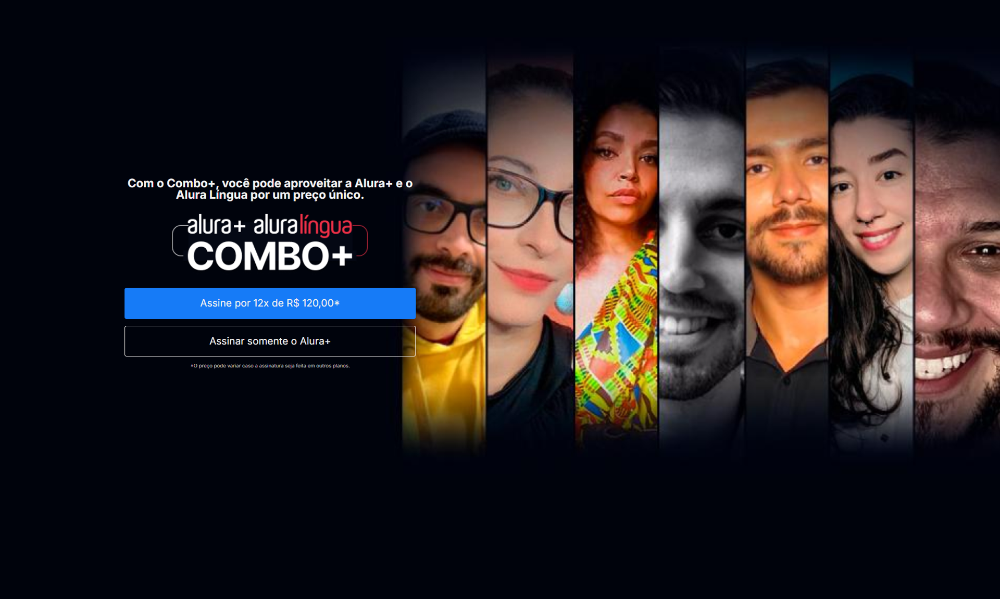

# ALURA PLUS
> Este repositório abriga um projeto de landing page para uma plataforma de streaming, desenvolvido com base em um material de estudo da [Alura](https://www.alura.com.br/). Durante o processo, coloquei em prática conceitos fundamentais que já dominava, ao mesmo tempo em que aprofundei e consolidei ainda mais meus conhecimentos.

## 📚 Materiais Ultilizados
* Design no Figma. *[Acesse aqui](https://www.figma.com/design/tNHLo3jwdNJORYLK4SeiBx/Alura-Plus?node-id=1-77&t=FXBbZOHpkF7KPjnL-0)*
* Curso HTML e CSS: Praticando HTML/CSS
* Vídeo Transformando Um Site Em Responsivo

## 🚀 Tecnologias Utilizadas
* [HTML](https://www.w3schools.com/html/)
* [CSS](https://www.w3schools.com/Css/)

## 🔧 Requisitos
* Visual Studio Code *[Baixe aqui](https://code.visualstudio.com/)*
* Figma. *[Acesse Online ou Instale](https://www.figma.com)*